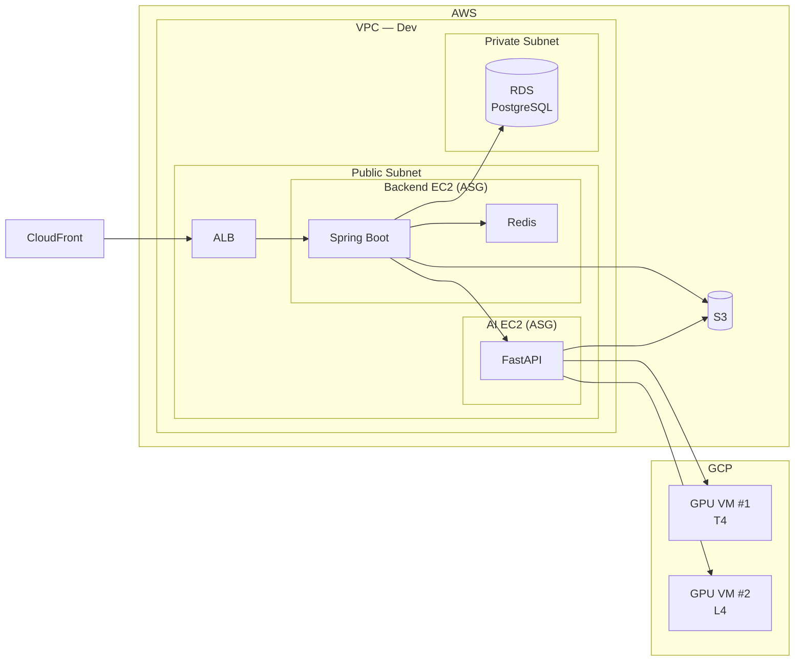

# Q-Feed Cloud Infrastructure

Q-Feed 클라우드 팀의 인프라 코드와 정책/가이드 문서를 관리하는 저장소입니다.

## 아키텍처 개요

### Dev 환경



## 주요 기술 스택

| 영역               | 기술                      |
| ------------------ | ------------------------- |
| IaC                | Terraform >= 1.0          |
| Cloud Provider     | AWS (ap-northeast-2)      |
| Compute            | EC2 + Auto Scaling Group  |
| Database           | RDS PostgreSQL 18.1       |
| Load Balancing     | Application Load Balancer |
| CDN / TLS          | CloudFront                |
| Container          | Docker                    |
| Secret 관리        | SSM Parameter Store       |
| 접속 관리          | SSM Session Manager       |
| Container Registry | ECR                       |

## 디렉토리 구조

```
.
├── terraform/                           # IaC (Terraform)
│   ├── README.md                        #   리소스 설명, 사용법, 팀 규칙
│   └── envs/
│       └── dev/
├── policy/                              # 팀 정책
│   ├── naming-policy.md                 #   네이밍 규칙 및 태깅 정책
│   ├── iam-policy.md                    #   IAM 역할/권한/계정 보안
│   └── git-workflow.md                  #   Git 브랜치, 커밋, PR 규칙
├── guide/                               # 가이드 문서
│   └── cloudwatch-logs-guide.md         #   CloudWatch Logs 사용 가이드
└── .github/
    └── ISSUE_TEMPLATE/
```
