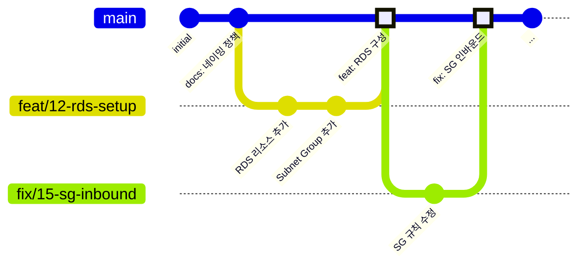

# Git 작업 플로우

## 1. 브랜치 전략

**GitHub Flow** 기반으로, `main` 브랜치 하나를 중심으로 운영한다.



### 1.1 브랜치 규칙

| 항목            | 규칙                                            |
| --------------- | ----------------------------------------------- |
| **main**        | 보호 브랜치. 직접 push 금지, PR을 통해서만 병합 |
| **작업 브랜치** | `main`에서 분기하여 작업 후 PR로 병합           |
| **병합 방식**   | Squash Merge (커밋 이력을 깔끔하게 유지)        |
| **병합 후**     | 작업 브랜치 삭제                                |

### 1.2 브랜치 네이밍

```
{type}/{issue번호}-{간단한-설명}
```

| Type       | 용도                | 예시                           |
| ---------- | ------------------- | ------------------------------ |
| `feat`     | 새 리소스/기능 추가 | `feat/12-rds-setup`            |
| `fix`      | 설정 오류 수정      | `fix/15-sg-inbound-rule`       |
| `docs`     | 문서 작업           | `docs/18-naming-policy`        |
| `refactor` | 코드 구조 개선      | `refactor/20-split-compute-tf` |
| `chore`    | 기타 설정           | `chore/22-gitignore-update`    |

> 이슈 없이 진행하는 간단한 작업은 번호 생략 가능: `docs/update-readme`

---

## 2. 작업 흐름

### 2.1 기본 흐름

```
1. Issue 생성 (스프린트 백로그)
2. 브랜치 생성 (main에서 분기)
3. 작업 & 커밋
4. PR 생성
5. 리뷰 & 병합
6. 브랜치 삭제
```

### 2.2 단계별 명령어

```bash
# 1. 최신 main에서 브랜치 생성
git switch main
git pull origin main
git switch -c feat/12-rds-setup

# 2. 작업 & 커밋
git add terraform/envs/dev/rds.tf
git commit -m "feat: RDS PostgreSQL 인스턴스 추가"

# 3. 원격에 push & PR 생성
git push -u origin feat/12-rds-setup
# → GitHub에서 PR 생성
```

---

## 3. 커밋 메시지

### 3.1 포맷

```
<type>: <subject>
```

- 한글로 작성
- 명령문 사용 ("추가", "수정", "삭제")
- 50자 이내, 끝에 마침표 생략

### 3.2 Type

브랜치 네이밍의 type과 동일: `feat`, `fix`, `refactor`, `docs`, `chore`

### 3.3 예시

```
feat: Backend EC2 Launch Template 및 ASG 추가
fix: RDS Security Group 인바운드 규칙 수정
refactor: common_tags를 locals로 분리
docs: 네이밍 정책 문서 작성
chore: .gitignore에 tfvars 패턴 추가
```

---

## 4. PR 규칙

### 4.1 PR 제목

커밋 메시지와 동일한 포맷 사용. Squash Merge 시 이 제목이 main의 커밋 메시지가 된다.

```
feat: RDS PostgreSQL 및 DB Subnet Group 추가
```

### 4.2 PR 본문

```markdown
## 관련 이슈

- closes #12

## 변경 내용

- RDS PostgreSQL 인스턴스 추가 (db.t4g.micro, Single-AZ)
- DB Subnet Group 생성 (Private Subnet 2개)
- RDS용 Security Group 추가

## 확인 사항

- [ ] `terraform plan` 정상 실행
- [ ] 네이밍 규칙 준수
- [ ] 필수 태그 적용

## 보안 체크

- [ ] SG에 `0.0.0.0/0` 인바운드가 불필요하게 추가되지 않았는가?
- [ ] IAM Policy에 `Action: "*"` 또는 `Resource: "*"`가 없는가?
- [ ] 시크릿이 `.tf` 파일에 하드코딩되어 있지 않은가?
```

### 4.3 리뷰

- **최소 1명** 승인 후 병합
- Terraform 변경 시 `terraform plan` 결과 공유 권장
- 긴급 수정(장애 대응 등)은 사후 리뷰 허용

---

## 5. 주의사항

### 5.1 커밋하면 안 되는 파일

| 파일                        | 이유                               |
| --------------------------- | ---------------------------------- |
| `*.tfvars`                  | DB 비밀번호, IP 등 민감 정보 포함  |
| `*.tfstate` / `*.tfstate.*` | State는 S3 Remote Backend에서 관리 |
| `.terraform/`               | 로컬 provider 캐시                 |

### 5.2 Terraform 변경 시

- `terraform apply`는 **main 브랜치에서만** 실행한다 (PR merge 후)
- PR에 `terraform plan` 출력 요약을 남긴다
- **destroy가 포함된 변경**은 PR 본문에 명시하고 리뷰어에게 알린다
- 네트워크, RDS 등 핵심 인프라 변경은 팀 전체 공유 후 진행
